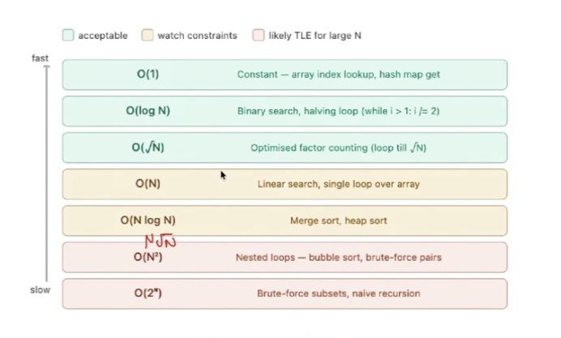

# Brackets
- [] brackets will include both numbers in range i.e., [1,5] will have 5 values. Formula b - a + 1;
- () brackets will exclude both numbers in range i.e., [1,5] will have 3 values. Formula b - a - 1;
- To find out the factorial in sqrt of n iterations check if i is divisible by N and count answer +2 and if i == N/i count +1;

# Big O notation Order

# How to approach a problem
- Read question & constraint carefully
- Come up with idea or logic
- Double-check the correctness of logic
- Create mental pseudocode and rough idea of loops.
- Work out the time complexity based on pseudocode.
- Check whether time complexity is feasible.
- Rethink the idea/logic if time complexity is not feasible.
- Code finally once confident enough about feasibility.